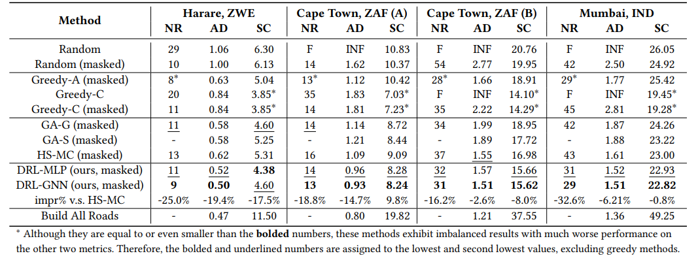

# Road Planning for Slums

---

In this project, we echo the *AI for Good* initiative and propose a deep reinforcement learning approach to perform road planning for slums, a critical issue in urban sustainability.
Our proposed model can generate road plans that significantly improve the connectivity of slums at minimal costs.
Experiments on slums from different countries demonstrates a relative improvement of over 14.3% in accessibility compared with existing baselines.

This project was initially described in the full paper [Road Planning for Slums via Deep Reinforcement Learning](paper/KDD2023_road_planning_for_slums.pdf) at KDD 2023 in Long Beach, CA. 
Contributors to this project are from the [Future Intelligence laB (FIB)](https://fi.ee.tsinghua.edu.cn/) at [Tsinghua University](https://www.tsinghua.edu.cn/en/).


# Installation 

### Environment
* Tested OS: Linux
* Python >= 3.8
* PyTorch == 1.10.1
* Tensorboard
### Dependencies:
1. Install [PyTorch 1.10.1](https://pytorch.org/get-started/previous-versions/) with the correct CUDA version.
2. Set the following environment variable to avoid problems with multiprocess trajectory sampling:
```
export OMP_NUM_THREADS=1
```


# Training

You can train your own models using the provided config in `road_planning/cfg`:

```
python -m road_planning.train --slum_name capetown1 --cfg demo --global_seed 0
```
You can replace `demo` to train other cfgs.

The results are saved in `train_data/slum_name/cfg/seed`

## Convergence
Our models, both DRL-GNN and DRL-MLP, usually converges with less than 100 iterations, which takes about 2 hours on a single server with an Nvidia
GeForce 2080Ti GPU.
We show the episodic reward (normalized to 0-1) after each iteration of training in the following figures.
|Harare, ZWE|Cape Town, ZAF|
|--|--|
|  |  |

# Results
- For accessibility, it is desired to achieve universal connectivity as early as possible, thus we calculate the **n**umber of **r**oad segments (**NR**) consumed to achieve universal connectivity.
- For travel distance, we compute the **a**verage **d**istance (**AD**) between any pair of places in the slum over the road network.
- We define the construction cost of each road segment as its length, and calculate the **s**um of **c**osts (**SC**) of all planned roads.

It is worth noting that all the metrics are **the lower the better**.



# License

The software in this repo is freely available under MIT license. Please see the [license](LICENSE) for further details.
