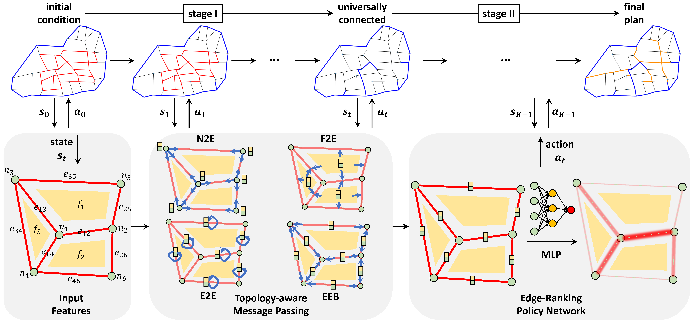
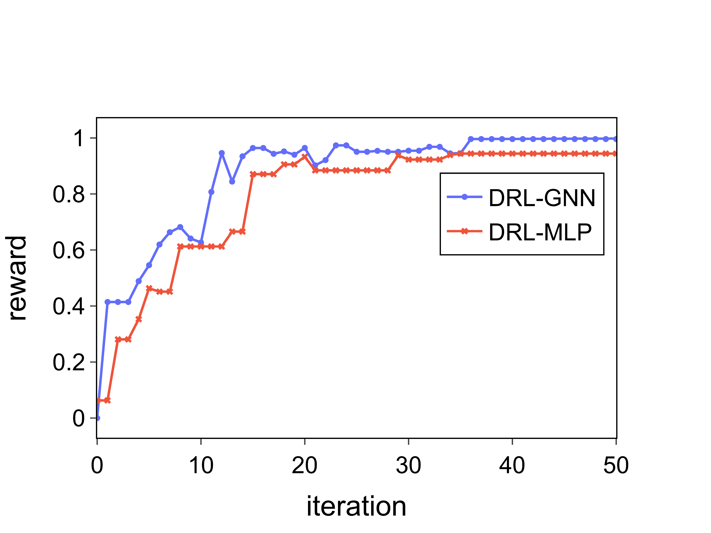
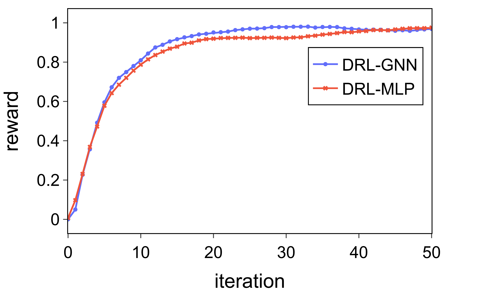

# Road Planning for Slums

---

This repo contains the codes and data for our submitted KDD'23 ADS track paper under review:

Yu Zheng, Hongyuan Su, Jingtao Ding, Depeng Jin, Yong Li, **Road Planning for Slums via Deep Reinforcement Learning**, in submission to KDD 2023.


# Installation 

### Environment
* Tested OS: Linux
* Python >= 3.8
* PyTorch == 1.10.1
* Tensorboard
### Dependencies:
1. Install [PyTorch 1.10.1](https://pytorch.org/get-started/previous-versions/) with the correct CUDA version.
2. Set the following environment variable to avoid problems with multiprocess trajectory sampling:
```
export OMP_NUM_THREADS=1
```


# Training

You can train your own models using the provided config in `road_planning/cfg`:

```
python -m road_planning.train --slum_name capetown1 --cfg demo --global_seed 0
```
You can replace `demo` to train other cfgs.

The results are saved in `train_data/slum_name/cfg/seed`

## Convergence
Our models, both DRL-GNN and DRL-MLP, usually converges within 20 iterations, which takes about 2 hours on a single server with an Nvidia
GeForce 2080Ti GPU.
We show the episodic reward (normalized to 0-1) after each iteration of training in the following figures.
|Harare, ZWE|Cape Town, ZAF|
|--|--|
|  |  |

# License

The software in this repo is freely available under MIT license. Please see the [license](LICENSE) for further details.
